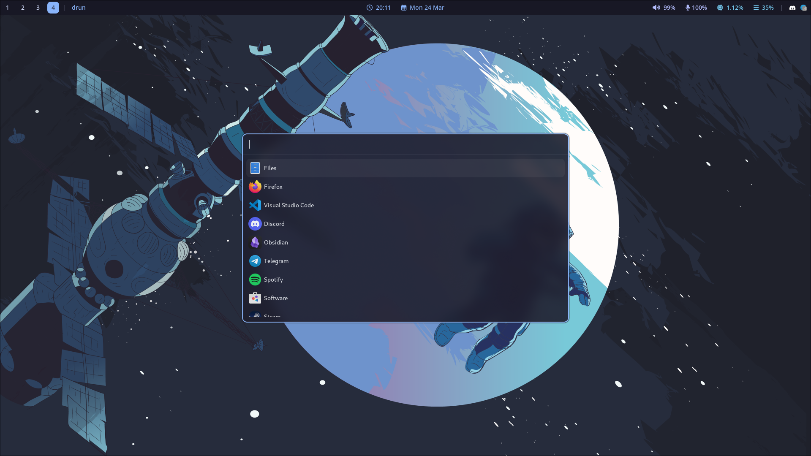
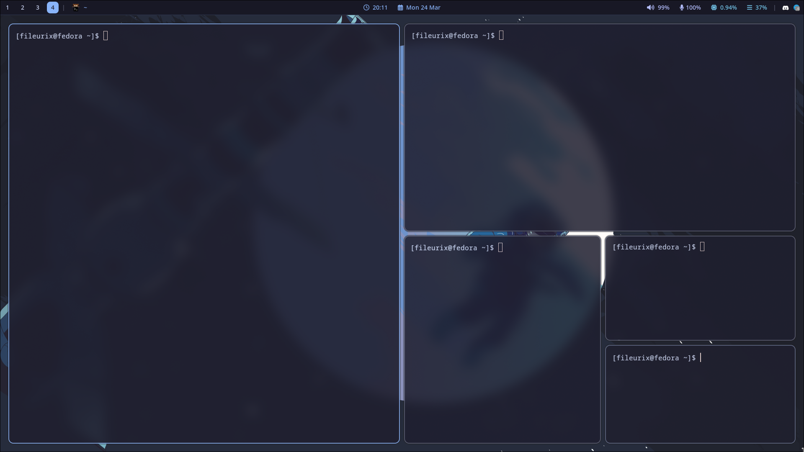

# My hyprland config

**dependencies**: `hyprland htop nvim cava hyperpaper ranger waybar wofi kitty hyprpolkitagent sxiv pavucontrol`

**neovim plug**:
`curl -fLo ~/.local/share/nvim/site/autoload/plug.vim --create-dirs https://raw.githubusercontent.com/junegunn/vim-plug/master/plug.vim`

## Programs

| Component      | Program                                                                 |
| -------------- | ----------------------------------------------------------------------- |
| Window manager | [Hyperland](https://hyprland.org/)                                      |
| shell          | [bash](https://www.gnu.org/software/bash/)                              |
| terminal       | [kitty](https://sw.kovidgoyal.net/kitty/)                               |
| File manager   | [ranger](https://github.com/ranger/ranger)                              |
| Editor         | [VSCode](https://code.visualstudio.com/) & [Neovim](https://neovim.io/) |
| Launcher       | [wofi](https://hg.sr.ht/~scoopta/wofi)                                  |
| Status bar     | [waybar](https://github.com/Alexays/Waybar)                             |

## Screenshot

