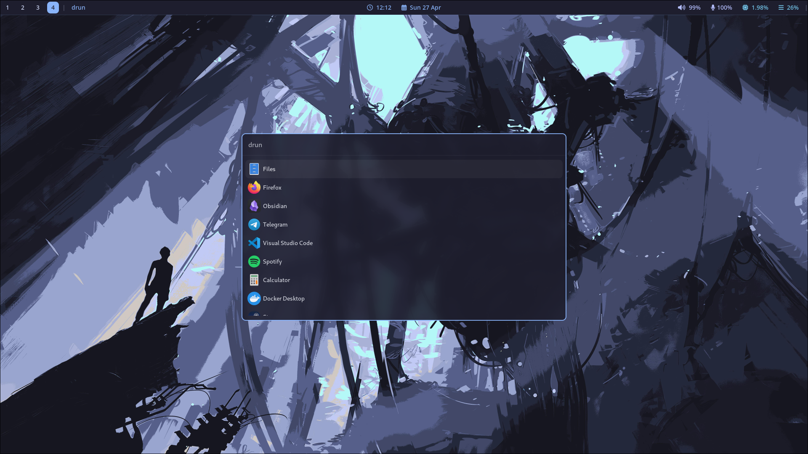
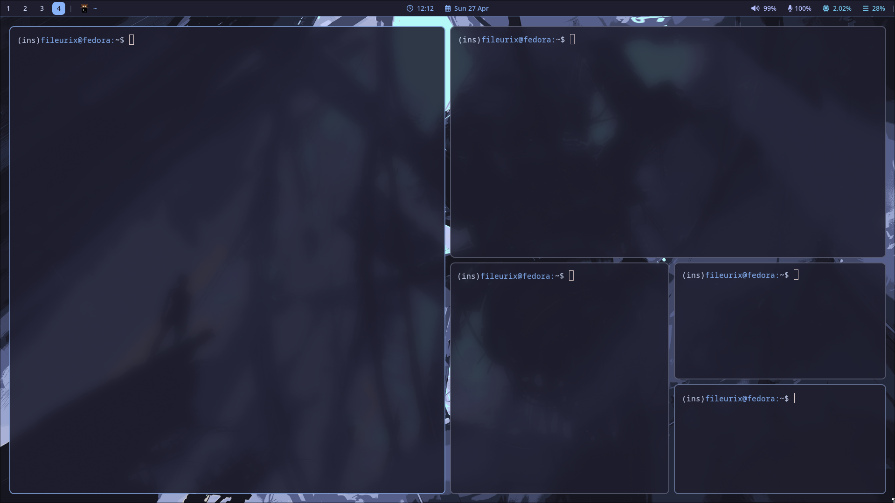
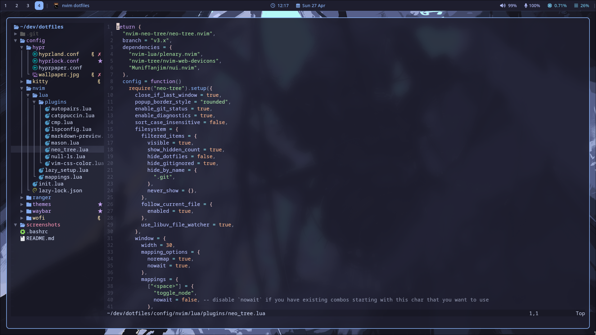

# Dotfiles

**dependencies**: `hyprland htop nvim cava hyperpaper ranger waybar wofi kitty hyprpolkitagent sxiv pavucontrol nwg-look`

## GTK theme

```bash
curl -LsSO "https://raw.githubusercontent.com/catppuccin/gtk/v1.0.3/install.py"
python3 install.py mocha blue
```

## Programs

| Component      | Program                                     |
| -------------- | ------------------------------------------- |
| Color Scheme   | [Catppuccin mocha](https://catppuccin.com/) |
| Window manager | [Hyperland](https://hyprland.org/)          |
| Shell          | [bash](https://www.gnu.org/software/bash/)  |
| Terminal       | [kitty](https://sw.kovidgoyal.net/kitty/)   |
| File manager   | [ranger](https://github.com/ranger/ranger)  |
| Editor         | [Neovim](https://neovim.io/)                |
| Launcher       | [wofi](https://hg.sr.ht/~scoopta/wofi)      |
| Status bar     | [waybar](https://github.com/Alexays/Waybar) |

## Screenshot





